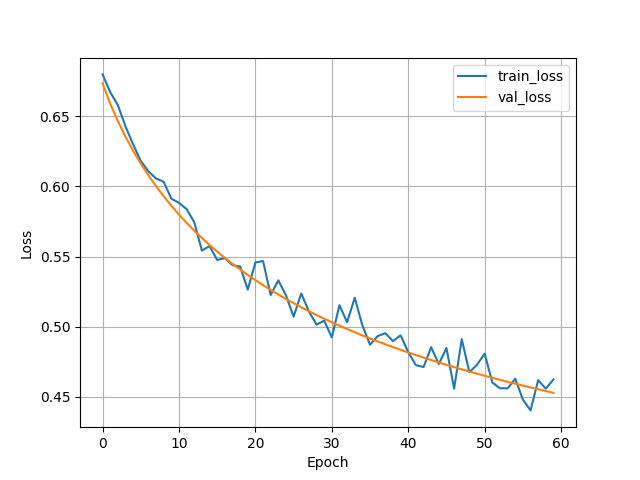

# NLP Bag of Words Project

This project implements a Bag of Words (BoW) model for sentiment analysis using the IMDB movie review dataset. The model is built with PyTorch and PyTorch Lightning, featuring text vectorization with scikit-learn's CountVectorizer and a simple logistic regression classifier.

## Project Overview

- **Dataset**: IMDB dataset (aclImdb) with positive and negative movie reviews. Source: [Stanford AI Lab](https://ai.stanford.edu/~amaas/data/sentiment/)
- **Model**: Logistic Regression classifier on Bag of Words features.
- **Framework**: PyTorch Lightning for training and evaluation.
- **Key Components**: Data loading, preprocessing, model training, and logging.

## Files and Directories

### Notebooks
- **Bag-of-words-Concept.ipynb**: Introductory notebook explaining the Bag of Words concept, likely with examples and theory.
- **Bag-of-words-model-Training.ipynb**: Main training notebook for the BoW model, including data preparation, model definition, training loop, and evaluation.
- **update_manual.ipynb**: Updated or manual version of the training notebook, with fixes and modifications.

### Python Scripts
- **local_dataset_utilities.py**: Utility functions for downloading and loading the IMDB dataset into a pandas DataFrame.
- **local_utilities.py**: Contains the `LightningModel` class (wrapping PyTorch model for Lightning), and plotting functions for training metrics.

### Data Files
- **train.csv**: Training data split (text and labels).
- **val.csv**: Validation data split.
- **test.csv**: Test data split.
- **aclImdb/**: Original IMDB dataset directory.
  - **imdb.vocab**: Vocabulary file.
  - **imdbEr.txt**: Error file or notes.
  - **README**: Dataset README.
  - **test/**: Test set with labeled reviews.
    - **labeledBow.feat**: Feature file.
    - **urls_neg.txt**, **urls_pos.txt**: URLs for negative/positive reviews.
    - **neg/**, **pos/**: Directories with negative and positive review text files.
  - **train/**: Training set with labeled and unsupervised reviews.
    - Similar structure to test/, plus **unsup/** for unsupervised data.

## What We Built

1. **Data Pipeline**:
   - Downloaded and partitioned the IMDB dataset into train/val/test CSVs.
   - Used CountVectorizer to convert text to 10,000-dimensional BoW features.

2. **Model**:
   - `LogicRegressionClassifier`: A PyTorch nn.Module with a single linear layer for binary classification.
   - Wrapped in `LightningModel` for Lightning integration, including loss (CrossEntropy), metrics (Accuracy), and optimizer (SGD).

3. **Training**:
   - Trained for 30 epochs on CPU (with option for MPS GPU).
   - Used ModelCheckpoint for saving best model based on validation accuracy.
   - Logged metrics to CSV for plotting.

4. **Evaluation**:
   - Computed training/validation/test accuracy and loss.
   - Plotted metrics over epochs.

## Results

After training (60 epochs completed):

- **Final Training Accuracy**: 83.64%
- **Final Validation Accuracy**: 83.62%
- **Final Test Accuracy**: 83.16%
- **Training Loss**: Decreased from ~0.69 to ~0.45 over epochs.

Training metrics are logged in `logs/my-model/version_11/metrics.csv`. The `plot_csv_logger` function generates plots for loss and accuracy.

### Training Loss

### Training Accuracy

## How to Run

1. **Setup Environment**:
   - Ensure Python 3.12 and virtual environment are activated.
   - Install dependencies: `pip install torch lightning scikit-learn pandas matplotlib torchmetrics`

2. **Run Notebooks**:
   - Start with `Bag-of-words-Concept.ipynb` for understanding.
   - Then `Bag-of-words-model-Training.ipynb` or `update_manual.ipynb` for training.

3. **Key Steps in Training**:
   - Load data and vectorize.
   - Create DataLoaders.
   - Instantiate model and Lightning wrapper.
   - Train with Trainer.

## Notes
- The project uses a simple linear model on BoW features, achieving baseline sentiment classification.
- For improvements, consider embeddings (e.g., Word2Vec) or more complex models like RNNs.
- GPU acceleration available via MPS on Mac.

## Dependencies
- torch
- lightning
- scikit-learn
- pandas
- matplotlib
- torchmetrics